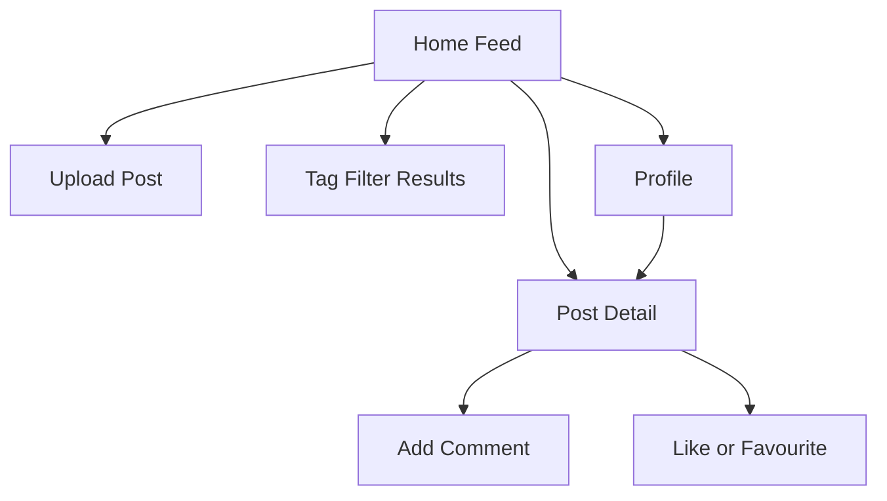
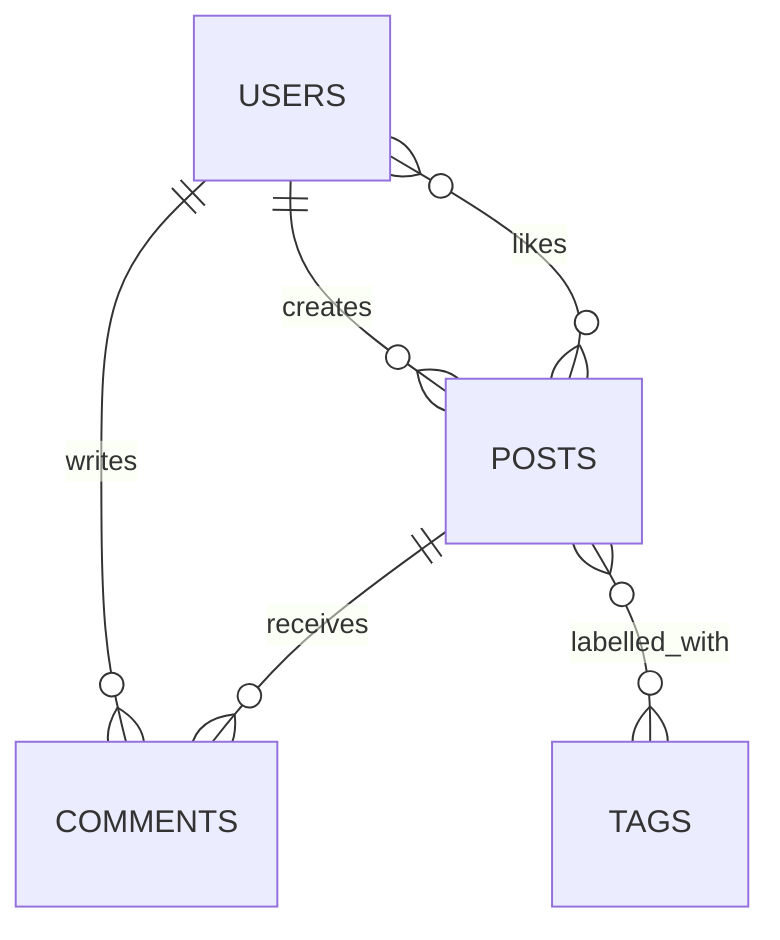

After defining the core functions of my image sharing website, the next step is to test whether the idea is actually practical within the course constraints. In this blog post, I use three planning tools to organise the concept: a site structure, a user flow, and a basic data model. Instead of only describing what I want to build, these tools help me analyse whether I can build it and which parts should be prioritised first.

## Key project constraints

According to the design brief, there are several constraints that cannot be ignored:

1. The core technology stack must use MojoJS, SQLite, and HTMX.
2. User authentication is handled by BlaBla Corp, so I should rely on session data rather than rebuilding the registration system.
3. The website must support both desktop and mobile devices.
4. Accessibility needs to meet AA standard or higher.
5. Cookie and tracking behaviour must comply with EU policies.
6. Ideal load times should be below 1 second and must not exceed 3 seconds.

These constraints directly affect design decisions. For example, since the course already specifies the stack, I should not introduce a heavy front-end framework because that would add complexity and risk moving away from the assignment requirements. In the same way, because the username can be accessed through the session stash, I should avoid unnecessary repeated database queries.

## Site structure planning

My current site structure is intentionally simple:

This structure covers the main tasks without becoming too difficult to implement. The home feed works as the central entry point of the whole website. From there, users can browse content, upload posts, or open a profile page. The post detail page becomes the main interaction area because comments, likes, and deeper engagement all happen there.

## Core user flow

I believe the most important flow in this prototype is:

1. The user opens the home feed.
2. The user chooses to upload a new image.
3. The user submits the image, caption, and tags.
4. The system saves the post and returns the user to the feed or the post detail page.
5. Other users browse the post and leave comments or likes.

This flow matters because it shows the core value of the platform. If uploading and browsing images feels smooth, then the main concept of the website works. On the other hand, if this flow is confusing or slow, the prototype will struggle even if many extra features are added.

## Initial data model

To check whether the database structure is manageable, I broke the system into several main entities:

Based on this model, I expect to need at least the following tables:

- `users`
- `posts`
- `comments`
- `tags`
- `post_tags`
- `likes`

This structure is feasible in SQLite and is strong enough to support the MVP without becoming overdesigned. The relationships between content types are also clear, which should make it easier later to render the home feed, count interactions, and filter posts by tag.

## Feasibility analysis

I believe the project itself is feasible. The real risk is not whether I can build an image upload and browsing system, but whether the scope becomes too large. In other words, the problem is less about technical possibility and more about trying to do too much and ending up with incomplete features.

For example, albums, notifications, moderation dashboards, and advanced search are all attractive ideas, but they would quickly increase the number of routes, database relationships, and interface states. If I try to include all of them during the prototype stage, development time will be spread too thin and the core experience may become less stable.

For that reason, a more realistic MVP should include:

- a recent image post feed
- an image upload form
- a post detail page
- comments
- tag filtering
- responsive layout

This feature set is enough to test whether the concept of an image sharing community website works, while also creating a good balance between technical complexity and user value.

## Technical approach

HTMX is especially useful for this project because I can apply progressive enhancement only where smoother interaction matters most, such as:

- partially refreshing the page after a comment is submitted
- updating like counts immediately
- dynamically replacing the content area during tag filtering

This approach supports performance goals, stays lighter than a full single-page application, and fits the required course stack more closely. In other words, I am not avoiding MojoJS and HTMX, but using them to improve interaction in a practical way.

## Accessibility and quality considerations

Accessibility needs to be considered from the beginning rather than added at the end. Because this platform is built around images, I need to pay particular attention to:

- alt text for uploaded images
- colour contrast in the interface
- keyboard accessibility for forms and buttons
- clear form labels and readable error messages

This is not only a formal requirement from the brief, but also a core usability issue. If users cannot navigate the interface smoothly or understand the image content, the community experience will break down.

## Current conclusion

From the current planning, this prototype is achievable and aligns well with the brief, as long as I focus on the primary experiences of uploading, browsing, and interacting rather than introducing complex social features too early. The most important insight at this stage is that information structure and user flow are just as important as visual design. If the home feed, post detail page, and upload process are clear, the project will already have a stable foundation for A2 development.
