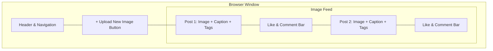
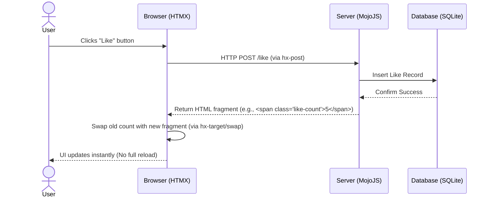

As I move from conceptual planning into the design phase of the image sharing community hub, my focus is on defining how users will interact with the platform. A key challenge is creating a fluid, modern interface without overcomplicating the technology stack or violating our performance constraints (sub-3 second load times).

## Wireframing the Core Experience

To visualise the layout before writing any HTML, I developed low-fidelity wireframes for the two most critical screens: the Home Feed and the Upload Modal. 

### Home Feed Layout
The Home Feed is the primary entry point. I decided on a single-column, vertical scrolling layout (similar to popular mobile-first social apps) rather than a dense grid. 

- **Reasoning:** A single-column layout ensures that images are displayed at a reasonable size, making it easier for users to appreciate the visual content. It also simplifies the responsive design, as the layout easily scales down to mobile devices without needing complex grid reflows.
- **Trade-off:** While a grid layout would show more content at once (higher information density), it often makes the interface feel cluttered and reduces the impact of individual images. Given that this is a community hub centered around visual sharing, giving each post room to breathe is more important.

### Upload Interaction
Instead of redirecting the user to a completely separate page to upload an image, I am designing the upload process as an overlay (modal) that can be accessed directly from the feed.
- **Reasoning:** This keeps the user in the context of their browsing session. They can quickly share a photo and immediately see it appear in the feed.

## Interaction Patterns with HTMX

The design brief specifies the use of MojoJS, SQLite, and HTMX. HTMX is particularly crucial for my interaction design. Instead of relying on traditional full-page reloads, I plan to use HTMX to swap specific HTML fragments. 

### Case Study: Liking a Post and Commenting
When a user clicks the "Like" button or submits a new comment on a post, doing a full page reload would disrupt their reading flow and increase server load. 

By using HTMX attributes (like `hx-post` and `hx-target`), I can send the interaction data to the server and only replace the "Like Count" or append the new comment to the "Comment List". 

**Why this matters:**
1. **Performance:** Only transferring a tiny HTML fragment is significantly faster than re-rendering and downloading the entire page. This directly supports the goal of keeping load times under 1 second.
2. **User Experience:** It mimics the seamless feel of a Single Page Application (SPA) built with React or Vue, but without the massive JavaScript bundle overhead. 

## Conclusion

By keeping the visual layout straightforward (single-column feed) and leveraging HTMX for asynchronous interactions, I am ensuring that the prototype remains highly usable. This approach balances the need for a modern, interactive community hub with the strict technical and performance constraints of the project.
