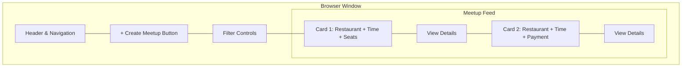
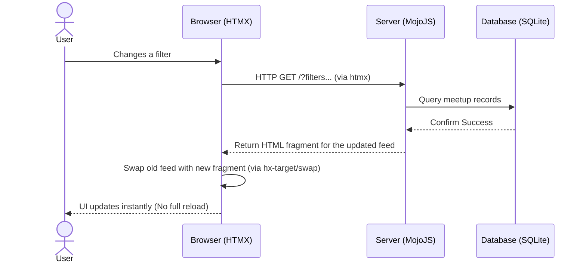

As I move from conceptual planning into the design phase of the restaurant meetup community hub, my focus is on defining how users will interact with the platform. A key challenge is creating a fluid, modern interface without overcomplicating the technology stack or violating our performance constraints (sub-3 second load times).

## Wireframing the Core Experience

To visualise the layout before writing any HTML, I developed low-fidelity wireframes for the two most critical screens: the Home Feed and the Create Meetup form.

### Home Feed Layout
The Home Feed is the primary entry point. I decided on a spacious vertical layout with featured introductory content at the top, followed by filtering controls and meetup cards rather than a dense multi-column grid.

```mermaid
flowchart TD
    subgraph Browser Window
        Nav[Header & Navigation]
        CreateBtn[+ Create Meetup Button]
        Filters[Filter Controls]
        
        subgraph Meetup Feed
            direction TB
            Meetup1[Card 1: Restaurant + Time + Seats]
            Action1[View Details]
            Meetup2[Card 2: Restaurant + Time + Payment]
            Action2[View Details]
        end
    end
    
    Nav --- CreateBtn
    CreateBtn --- Filters
    Filters --- Meetup1
    Meetup1 --- Action1
    Action1 --- Meetup2
    Meetup2 --- Action2
```

- **Reasoning:** A more editorial single-column flow keeps each meetup readable. Users need to compare practical details such as time, payment mode, and remaining spots, so giving each card enough space is more useful than showing many tiny items at once.
- **Trade-off:** A more compact dashboard could display more meetups on one screen, but it would make the key planning details harder to scan, especially on mobile devices.

### Create Meetup Interaction
Instead of making the creation flow feel like a hidden admin task, I want it to be a clear first-class action in the interface. The user should be able to move from the home feed to a dedicated meetup form with strong visual guidance and validation.

- **Reasoning:** Meetup creation includes several practical and safety-related decisions, so a full form page is more appropriate than a tiny inline control. It gives enough room for clear labels, helper text, and a visible safety acknowledgement.

## Interaction Patterns with HTMX

The design brief specifies the use of MojoJS, SQLite, and HTMX. HTMX is particularly crucial for my interaction design. Instead of relying on traditional full-page reloads, I plan to use HTMX to swap specific HTML fragments. 

### Case Study: Filtering Meetups
When a user changes the payment, availability, or time filters, doing a full page reload would interrupt the browsing flow and make the interface feel slower than necessary.

By using HTMX attributes such as `hx-get`, `hx-target`, and `hx-swap`, I can send the filter state to the server and replace only the meetup feed area instead of reloading the entire page. 

```mermaid
sequenceDiagram
    actor User
    participant Browser (HTMX)
    participant Server (MojoJS)
    participant Database (SQLite)
    
    User->>Browser (HTMX): Changes a filter
    Browser (HTMX)->>Server (MojoJS): HTTP GET /?filters... (via htmx)
    Server (MojoJS)->>Database (SQLite): Query meetup records
    Database (SQLite)-->>Server (MojoJS): Confirm Success
    Server (MojoJS)-->>Browser (HTMX): Return HTML fragment for the updated feed
    Browser (HTMX)->>Browser (HTMX): Swap old feed with new fragment (via hx-target/swap)
    Browser (HTMX)-->>User: UI updates instantly (No full reload)
```

**Why this matters:**
1. **Performance:** Only transferring a tiny HTML fragment is significantly faster than re-rendering and downloading the entire page. This directly supports the goal of keeping load times under 1 second.
2. **User Experience:** It mimics the seamless feel of a Single Page Application (SPA) built with React or Vue, but without the massive JavaScript bundle overhead. 

### Responsible Interface Decisions
Because the platform deals with offline meetups, the interface needs to do more than look attractive. It also needs to guide safer behaviour. For that reason, I plan to make a few interface decisions early:

- visible safety guidance on the home page
- a clear confirmation checkbox in the meetup creation form
- no pressure to disclose more personal data than necessary
- labels that present gender and preference fields as self-declared planning information rather than verified identity

These choices are part of the interaction design, not separate from it. A smooth interface that ignores safety concerns would not be a responsible solution for this type of product.

## Conclusion

By keeping the visual layout straightforward and using HTMX selectively for interactions such as filtering, I am ensuring that the prototype remains highly usable. This approach balances the need for a modern, interactive community hub with the strict technical and performance constraints of the project. More importantly, it allows the design to stay focused on what matters most for this concept: helping users understand a meetup quickly and decide whether to join with confidence.
