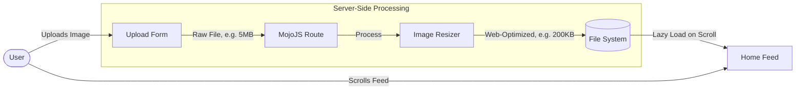

Building a functional prototype is only part of the challenge; ensuring it is usable by everyone and performs well under real-world conditions is equally important. The design brief explicitly requires meeting AA accessibility standards and maintaining load times between 1 and 3 seconds. In this post, I will outline my strategies for achieving and evaluating these non-functional requirements.

## Performance: Handling Image Assets

Since my community hub is centered around image sharing, image file sizes are the biggest threat to my page load time constraints. If ten users upload unoptimized 5MB images, the home feed will easily exceed the 3-second limit.

### Mitigation Strategies:
1. **Server-Side Resizing:** When a user uploads an image, the backend should not simply save the raw file. I plan to process the image to generate a smaller, web-optimized version. 
2. **Lazy Loading:** I will implement the `loading="lazy"` attribute on all `` tags in the feed. This ensures the browser only downloads images as they approach the user's viewport, drastically reducing the initial page load time and saving bandwidth.

**Trade-off considered:** Processing images on the server consumes resources during the upload phase, slightly slowing down the creation process. However, this one-time cost during upload is far outweighed by the repeated benefits of fast loading times for every user who subsequently views the feed.

## Accessibility: Meeting the AA Standard

Accessibility cannot be an afterthought; it must be integrated into the HTML structure from the beginning. 

### Key Implementation Details:
- **Meaningful Alt Text:** Images are the core content, so `alt` text is critical for screen reader users. I will add an "Image Description" field to the upload form, distinct from the visual caption, to ensure users explicitly describe the image content. 
- **Color Contrast and Typography:** The interface will use a high-contrast color palette for text against backgrounds to meet the WCAG 2.1 AA contrast ratio requirements (4.5:1 for normal text).
- **Keyboard Navigation:** By using semantic HTML (`<button>` for actions like voting, `<a>` for navigation, `<form>` for inputs), I ensure that the site is fully navigable via keyboard without needing complex custom JavaScript event handlers.

## Evaluation Plan

To prove that these strategies work, I need a concrete evaluation plan for the A3 reflection phase:
1. **Lighthouse Auditing:** I will use Google Chrome's Lighthouse tool to run automated performance and accessibility audits on the deployed prototype. My target is to score above 90 in both categories.
2. **Manual Testing:** Automated tools cannot catch everything. I will manually test keyboard navigation by tabbing through the site and use a screen reader to ensure the image feed makes sense when read aloud.

By planning these technical strategies and evaluation methods now, I can build the prototype with confidence, knowing that the foundation is optimized for both speed and inclusivity.
