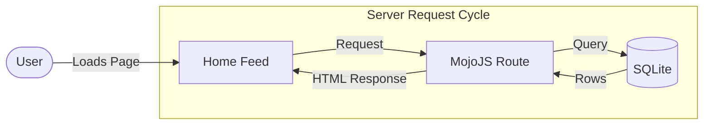

Building a functional prototype is only part of the challenge; ensuring it is usable by everyone and performs well under real-world conditions is equally important. The design brief explicitly requires meeting AA accessibility standards and maintaining load times between 1 and 3 seconds. In this post, I will outline my strategies for achieving and evaluating these non-functional requirements.

## Performance: Keeping the Experience Lightweight

Since my community hub is centered around meetup planning rather than heavy media uploads, my performance risks are different from those in an image-first platform. The main risks here are inefficient database queries, unnecessary full page reloads, and loading too much content at once.

### Mitigation Strategies:
1. **Simple data model:** I will keep the number of tables and relationships limited to the MVP so the application remains easy to query and render.
2. **Server-rendered templates:** Most pages will be rendered on the server rather than relying on a heavy client-side framework.
3. **Selective HTMX use:** I will only use HTMX where it improves the experience, such as filtering or small interaction updates.
4. **External image references instead of uploads:** The prototype can use pasted `https` photo URLs rather than large uploaded files, which reduces the performance and implementation burden.

```mermaid
flowchart LR
    User([User]) -->|Loads Page| Browser[Home Feed]
    
    subgraph Server Request Cycle
        Browser -->|Request| Backend[MojoJS Route]
        Backend -->|Query| Database[(SQLite)]
        Database -->|Rows| Backend
        Backend -->|HTML Response| Browser
    end
```

**Trade-off considered:** Using external photo URLs gives me a much lighter prototype, but it also means I have less control over image quality and availability. For the A2 scope, this is an acceptable trade-off because the restaurant photo is only supporting information, not the main content object.

## Accessibility: Meeting the AA Standard

Accessibility cannot be an afterthought; it must be integrated into the HTML structure from the beginning. 

### Key Implementation Details:
- **Clear labels and validation:** Every form control in the meetup creation flow should have a meaningful label, helper text where necessary, and readable error messages.
- **Color contrast and typography:** The interface will use a high-contrast palette for text against background surfaces to meet WCAG 2.1 AA contrast expectations.
- **Keyboard navigation:** By using semantic HTML (`<button>` for actions, `<a>` for navigation, `<form>` for inputs), I ensure that the site is fully navigable via keyboard without needing complex custom JavaScript event handlers.
- **Readable status information:** Seat counts, payment modes, and participation states must be communicated in plain text rather than only through colour or layout.

Although the app includes a photo URL for each meetup, the image is still secondary to the planning information. This means accessibility work should focus heavily on form clarity, information hierarchy, and understandable text.

## Responsible implementation and privacy

This project also has an ethical design dimension because it supports in-person meetings between users. For that reason, accessibility and quality are not the only concerns. The prototype also needs to be responsible in the way it handles user data and user expectations.

### Key responsible implementation choices:
- only collect information that is directly useful for planning the meetup
- avoid requiring phone numbers, home addresses, or other sensitive personal data
- treat gender and preference fields as self-declared information rather than verified identity
- encourage public venues rather than private meeting locations
- explain that session cookies are essential for authentication rather than hidden tracking tools

These decisions reduce privacy risk while still allowing the core meetup workflow to function.

## Evaluation Plan

To prove that these strategies work, I need a concrete evaluation plan for the A3 reflection phase:
1. **Lighthouse Auditing:** I will use Google Chrome's Lighthouse tool to run automated performance and accessibility audits on the deployed prototype. My target is to score above 90 in both categories.
2. **Manual Testing:** Automated tools cannot catch everything. I will manually test keyboard navigation by tabbing through the site and confirm that forms, buttons, and links are still understandable without a mouse.
3. **Task-based verification:** I will test critical flows such as logging in, creating a meetup, joining a meetup, leaving a meetup, and applying filters.
4. **Responsible design review:** I will review whether safety guidance is visible, whether unnecessary personal data is avoided, and whether the interface clearly communicates that meetups should happen in public venues.

By planning these technical strategies and evaluation methods now, I can build the prototype with confidence, knowing that the foundation is optimized for both speed and inclusivity.
